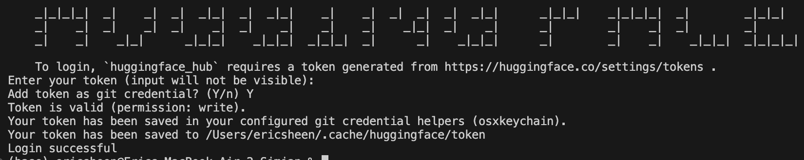
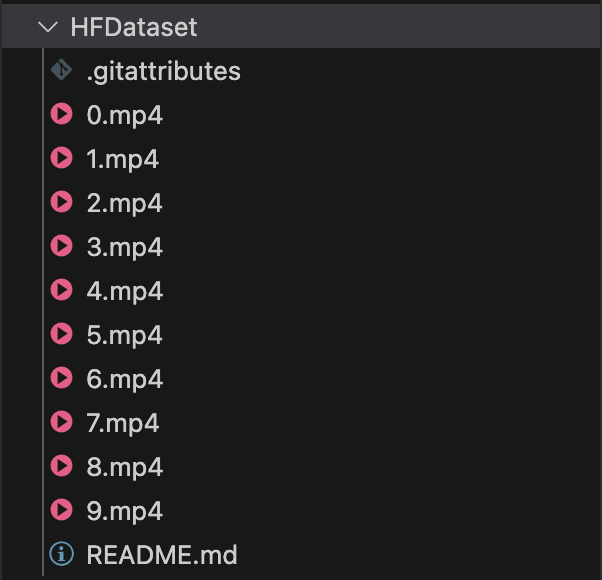

# Navigating Huggingface

This dir will include the important aspects (at least what I ran into).

<br/>

Sections include:
1) Downloading dataset from HuggingFace
2) Manipulating (uploading/removing) your own dataset to HuggingFace

## Let's start

HuggingFace docs (but be lazy and continue reading): https://huggingface.co/docs/huggingface_hub/en/guides/cli

We are NOT going to use the UI to manually upload or delete videos from huggingface. That's what noobs do fr.

1) Install CLI:

```
pip install -U "huggingface_hub[cli]"
```

2) Login bro, create and get access token [here](https://huggingface.co/settings/tokens):

```
huggingface-cli login
```



3) Download a dataset.

```
# Example URL: https://huggingface.co/datasets/RaccoonResearch/simian100
>>> huggingface-cli download RaccoonResearch/simian100 --repo-type dataset
```

Get it out of your cache:

```
cp -r /Users/<womp>/.cache/huggingface/hub/datasets--RaccoonResearch--simian100/snapshots/c1291f6e8b85c1113d17865854073415c4aff7f7/ ./HFDataset
```



## I own a dataset and want to upload/remove from it kinda like GitHub. plz help.

Gotchu bro.

Make sure we have git lfs installed. Git lsf is an extension to git and it's used to handle large files more efficiently.
```
brew install git-lfs
git lfs install
```

Literally treat it like GitHub
```
git clone https://huggingface.co/datasets/RaccoonResearch/simian100
```

remove the .mp4 files you want

```
git add -A
git commit -m "removed mp4 files"
git push
```

lightwork no reaction.